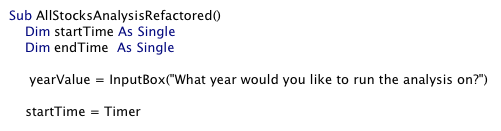
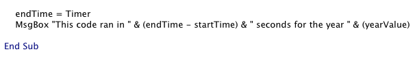
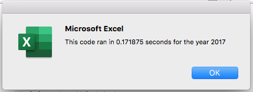
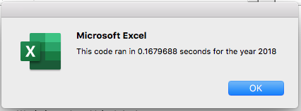

# Stocks-Analysis

## Overview of Project

The purpose of this project was to determine whether the act of refactoring a specific code involving stocks analysis would result in a more efficient performance in VBA for Excel.  To begin, a dataset of 3,013 observations involving twelve stock tickers, including their respective daily volumes and prices, were analyzed in a macro using a variety of codes.  These codes included the implementation of arrays, nested for loops, as well as static and conditional formatting to output the calculations for the total daily volumes and percentage returns for each of the twelve stocks.  The same code was then refactored in attempt to improve efficiency for a prospective client named "Steve" who sought a coding method which could be reliable when upscaling its use to analyze the entire stock market.

---
## Measuring the Performance

In order to measure and compare the performance of the original code against the refactored code, variables labeled "startTIme" and "endTime" were strategically placed before and after each code, respectively, and assigned to the timer function in the macros within VBA.  Consequently, the value of each variable retained a useful snapshot of the time, both before and after the moment each code ran.

---

---

Hence, the processing time it took to run each code to produce outputs to Excel was easily obtained by subtracting the difference between the "startTime" variable and the "endTime" variable.  Each code was performed twice; once to analyze stock data for the year 2017 and once again for the year 2018.  The MsgBox function in Excel provided a convenient display of the speed results in a "pop-up" window.

## Results

From the analysis, it is clear the refactored code produced a significantly higher performance than the original code.  Specifically, the original code ran at a speed of 0.6054688 seconds for the year 2017 and 0.6015625 seconds for the year 2018.  In contrast, the factored code performed the same analysis in 0.171875 seconds for the year 2017 and 0.1679688 seconds for the year 2018.  This is a clear improvement in performance due to the rafactoring process.

---

## Summary

In conclusion, the refactoring process can certainly serve as a highly effective method for improving code performance.  Some of the advantages of refactoriing code in general include (but are not limited to) the ability to maximize computer resources that might otherwise be hindered by excessive processing and the ability to restructure the aesthetics of a code design in order to make it more readable for a user.  On the other hand, some disadvantages include the potential that refactoring can be time-consuming itself and, therefore, one has to consider whether the potential performance improvement is worth the extra time devoted to refactoring in the first place, especially if a project has a deadline to meet.  Also, if a code is working adequately already, attempting to refactor the code may not actually improve performance and results may vary according to the situation.

For this specific analysis involving stocks data, the refactoring process was very advantageous overall as the primary goal of refactoring was to serve a client named "Steve" who needed a faster code to upscale its use on a grander scale.  However, the process of refactoring required the introduction of additional variables, extra time and effort, and further calculations in order to ensure the end result was an improvement after all.  As such, it is possible to conceive that even after all these efforts, sometimes the level of improvement may not be worth the extra time spent refactoring.  Nevertheless, if a programmer considers these possibilities before committing to the refactoring process and still warrants the effort worthwhile, positive results may certainly be achieved, as evidenced by this analysis.